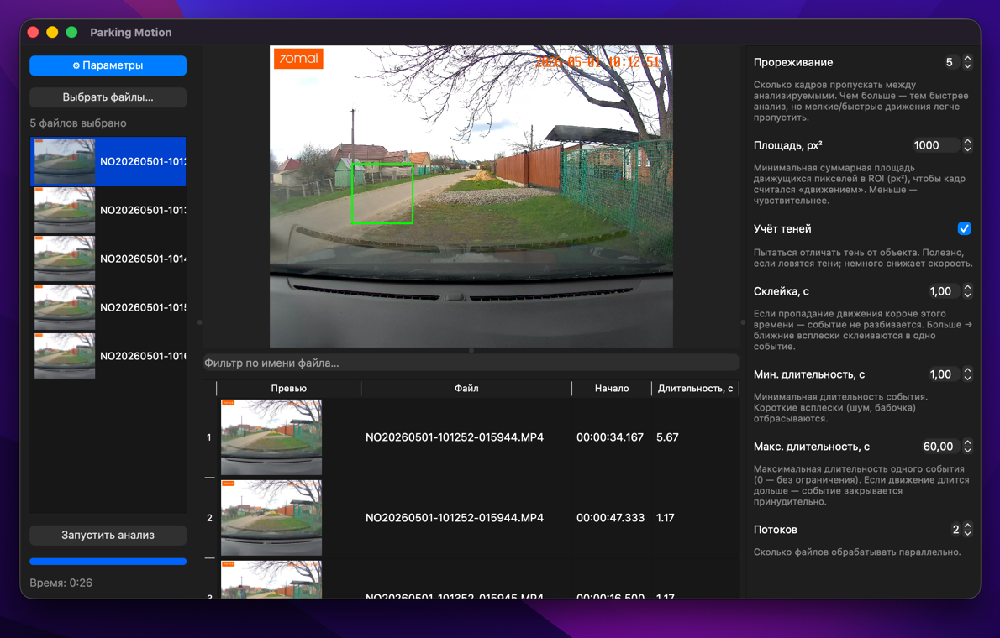

# Parking Motion

Десктоп-приложение для детекции движения в выделенной области на записи со статичной камеры наблюдения.



## Описание

Сканирует каталог с записями со статичной камеры наблюдения, ищет движение в
выделенной области, которую вы обвели мышью на стоп-кадре, склеивает близкие
всплески движения в дискретные события и показывает их в таблице с превью
кадра. По двойному клику событие открывается во встроенном плеере на отметке
начала.

## Возможности

- Выбор отдельных видеофайлов с мультивыбором (`.mp4`, `.avi`, `.mkv`, `.mov`)
- Рисование выделенной области прямо на стоп-кадре выбранного файла
- Фоновый анализ с процентом прямо в строке файла и общим счётчиком «N из M», отменой в любой момент
- Таблица событий с превью кадра и кнопкой скачивания клипа в каждой строке
- Экспорт всех найденных событий пакетом — в один склеенный файл или отдельными `.mp4`
- Встроенный плеер: play/pause/stop, перемотка ←/→ (5с), ползунок, Space
- 9 настраиваемых параметров детекции с пояснениями

## Установка

Готовые установщики собираются автоматически и публикуются в [Releases](https://github.com/vragovR/parking-motion/releases/latest).

### macOS

1. Скачать `parking-motion-macos.dmg` из последнего релиза.
2. Двойной клик по DMG — откроется окно с иконкой `.app` и алиасом `Applications`.
3. Перетянуть `Parking Motion.app` на `Applications`.
4. Запустить из Launchpad. **Первый запуск:** правый клик по приложению → Open. Приложение unsigned, поэтому Gatekeeper при обычном двойном клике откажется его открывать; через контекстное меню разрешение запоминается, дальше открывается как обычно.

### Windows

1. Скачать `parking-motion-windows-setup.exe` из последнего релиза.
2. Запустить установщик. SmartScreen может предупредить о «Unknown publisher» — нажать «More info → Run anyway».
3. Пройти wizard «Welcome → Install» (по умолчанию ставится в `%LOCALAPPDATA%\Programs\Parking Motion` без admin-прав).
4. Запускать через Start Menu или ярлык на рабочем столе (если оставили галку при установке).

Удаление — через «Программы и компоненты» (Windows) или перетаскивание `Parking Motion.app` в Корзину (macOS).

## Использование

1. **Выбрать файлы** — диалог с мультивыбором, можно собрать видео из разных папок. В списке слева они появятся отсортированными по имени.
2. Кликнуть по файлу в списке — появится стоп-кадр.
3. Обвести мышью прямоугольник вокруг машины — это и есть выделенная область.
4. **Запустить анализ**. Обработка идёт в фоне; активный файл подсвечен, в его строке виден процент, внизу — счётчик «N из M файлов».
5. Двойной клик по событию открывает плеер на отметке начала события.
6. **Скачать клип** — кнопка со стрелкой вниз в строке события сохраняет одиночный клип. Кнопка «Экспорт всех…» под таблицей (активна после полного анализа) предложит склеить всё в один файл или сохранить отдельными `.mp4`.
7. При желании настроить параметры в правой панели и перезапустить анализ.

Состояние не сохраняется между запусками — каждый запуск с чистого листа.

## Параметры

| Параметр                  | Что делает                                                                   |
| ------------------------- | ---------------------------------------------------------------------------- |
| Прореживание              | Сколько кадров пропускать (быстрее → грубее).                                |
| Площадь, px²              | Минимальная суммарная площадь движения в выделенной области.                 |
| Мин. площадь блоба, px²   | Отдельные блобы меньше этого — игнорируются (фильтр мелкого шума).           |
| Учёт теней                | Отличать тень от объекта (MOG2).                                             |
| Склейка, с                | Пауза в движении меньше — события не разбиваются.                            |
| Мин. длительность, с      | Короткие события отбрасываются.                                              |
| Мин. кадров движения      | Минимум сэмплов с движением в событии (фильтр одиночных блипов).             |
| Мин. пиковая площадь, px² | Самый «громкий» кадр события должен превышать этот порог (фильтр слабых FP). |
| Макс. длительность, с     | Принудительное закрытие, если движение слишком длинное.                      |

## Разработка

Требуется Python 3.12+. CI гоняется на 3.12, локально проверено на 3.14.

### Установка окружения

```bash
git clone git@github.com:vragovR/parking-motion.git
cd parking-motion
python3 -m venv .venv
source .venv/bin/activate          # Windows: .venv\Scripts\activate
make dev                           # editable install + ruff + pytest
```

### Запуск из исходников

```bash
make run                           # либо: python -m parking_motion
```

### Тесты, линт, форматирование

```bash
make test                          # pytest
make lint                          # ruff check
make format                        # ruff format (с записью)
make format-check                  # без записи (как в CI)
```